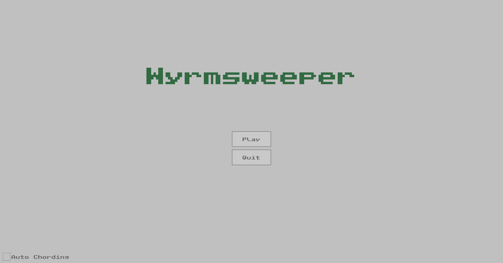
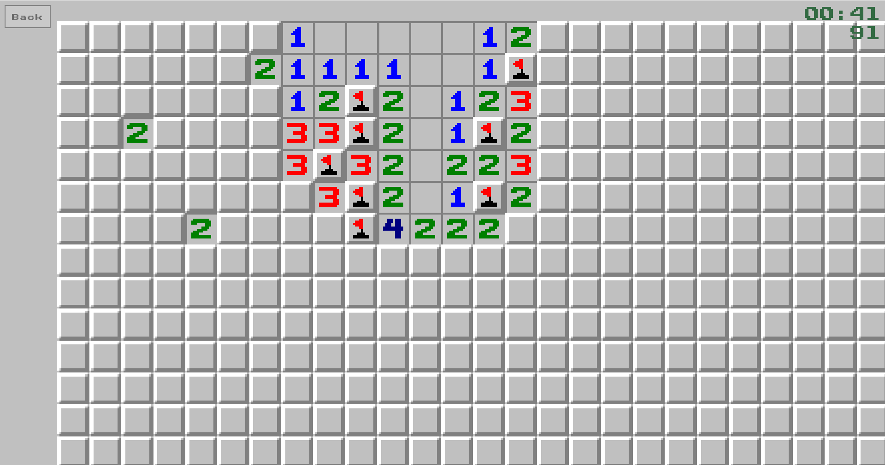
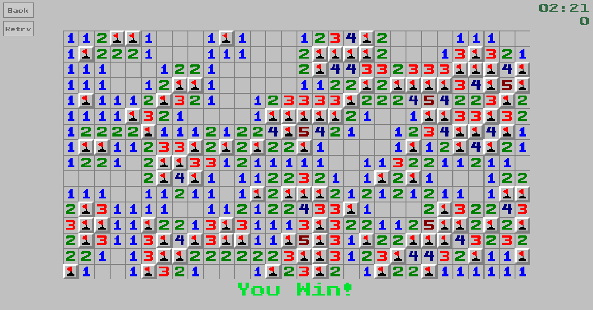

# Wyrmsweeper

A simple cross-platform Minesweeper clone made with C++ and Raylib.  
The goal of this project was to make the exe standalone and very small.  
No assets folder or any settings or statistics that get stored on your computer.

## Building

This project uses CMake as its build system. CMake will automatically download the
necessary [dependencies](#dependencies).  
Then just use one of the presets to build or use your own:  
`cmake --preset x64-windows-msvc-release`

## Dependencies

- [Raylib](https://github.com/raysan5/raylib)
- [Raygui](https://github.com/raysan5/raygui)

## Features

- **Difficulties:** Easy, Advanced, Hard, Custom
- 2D camera controls (moving, zooming)
- 'Auto-Chording' option
- 'Theming system' (for more info see [here](assets/README.md))

## Controls

### In game:

**[Left Mouse]** Open tile  
**[Left Mouse on open Tile]** Chord click  
**[Middle Mouse]** Drag camera  
**[Right Mouse]** Place flag  
**[Mouse Wheel]** Zoom camera  
**[Escape]** Quit to menu

## Screenshots

